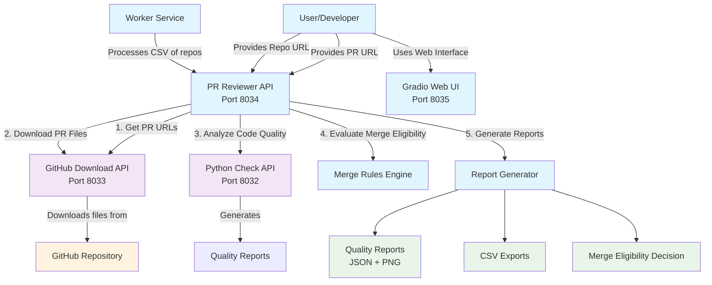

# Code Quality Analysis System

A comprehensive microservices-based system for automated Pull Request (PR) analysis and code quality evaluation. This system consists of three interconnected APIs that work together to download, analyze, and evaluate GitHub pull requests.

## 🏗️ Architecture Overview

The system is composed of three main services:

1. **GitHub Download API** (`github_download`) - Downloads PR files and metadata from GitHub
2. **Python Check API** (`python_check`) - Performs code quality analysis
3. **PR Reviewer API** (`pr_reviewer`) - Orchestrates the entire analysis workflow

## 📋 Service Details

### 1. GitHub Download API 📥
**Port:** 8033  
**Purpose:** Downloads and manages GitHub repository and PR data

**Key Features:**
- Fetches open pull requests from repositories
- Downloads all changed files from PRs as ZIP packages
- Handles both public and private repositories
- Provides file metadata and download information

**Main Endpoints:**
- `POST /api/v1/github/repos/pr-urls` - Get all PR URLs from a repository
- `POST /api/v1/pr/download-pr-files` - Download all files from a specific PR
- `GET /health` - Health check

### 2. Python Check API 🔍
**Port:** 8032  
**Purpose:** Performs comprehensive code quality analysis

**Key Features:**
- Multi-language code analysis (Python, JavaScript, TypeScript, Java, C++, Go, etc.)
- Linting with Pylint, Flake8, and MyPy
- Complexity analysis
- Secret scanning
- Batch file processing
- Configurable quality thresholds

**Main Endpoints:**
- `POST /analyze-code-quality` - Analyze single code snippet
- `POST /analyze-batch-code-quality` - Analyze multiple uploaded files
- `POST /analyze-single-file-upload` - Analyze single uploaded file
- `POST /analyze-batch-code-quality-body` - Analyze multiple files from request body
- `GET /health` - Health check

**Quality Metrics:**
- **Pylint Score:** Code quality rating (0-10)
- **Flake8 Violations:** Style and error checking
- **MyPy Errors:** Type checking validation
- **Complexity Score:** Cyclomatic complexity analysis
- **Secret Scanning:** Detection of potential secrets/credentials

### 3. PR Reviewer API 🎯
**Port:** 8034  
**Purpose:** Main orchestrator that coordinates the entire analysis workflow

**Key Features:**
- Orchestrates end-to-end PR analysis pipeline
- Integrates with GitHub Download API and Python Check API
- Evaluates PR merge eligibility based on configurable rules
- Generates comprehensive quality reports
- Provides web interface via Gradio (Port 8035)
- Batch processing of multiple repositories

**Main Endpoints:**
- `POST /analyze-pr` - Analyze a single PR
- `POST /analyze-repo` - Analyze all PRs in a repository
- `POST /open-prs` - Get open PRs from a repository
- `GET /health` - Health check

**Additional Components:**
- **Worker Service:** Processes multiple repositories from CSV files
- **Gradio Interface:** Web UI for interactive analysis (Port 8035)

## 🔄 System Workflow & Diagram Walkthrough



### Detailed Workflow Steps:

1. **Input Reception** 📥
   - User provides PR URL or repository URL via:
     - REST API call to PR Reviewer API (8034)
     - Web interface through Gradio UI (8035)
     - Worker service processing CSV files

2. **PR Discovery** 🔍
   - PR Reviewer API calls GitHub Download API (8033)
   - GitHub Download API fetches open PRs from the repository
   - Returns list of PR URLs and metadata

3. **File Download** 📁
   - For each PR, GitHub Download API downloads:
     - All changed files
     - PR metadata (title, author, description, etc.)
     - Creates ZIP packages and download_info.json

4. **Quality Analysis** 🔬
   - PR Reviewer API sends downloaded files to Python Check API (8032)
   - Python Check API performs:
     - Linting (Pylint, Flake8, MyPy)
     - Complexity analysis
     - Secret scanning
     - Returns comprehensive quality report

5. **Merge Evaluation** ⚖️
   - PR Reviewer API applies configurable merge rules
   - Evaluates based on:
     - Quality thresholds
     - PR metadata (description length, approvals, etc.)
     - Custom business rules

6. **Report Generation** 📊
   - Generates visual quality reports (PNG)
   - Creates detailed JSON reports
   - Exports CSV summaries
   - Determines merge eligibility

## 🚀 Getting Started

### Prerequisites
- Docker and Docker Compose
- GitHub Token (for private repositories)
- Python 3.8+ (for local development)

### Quick Start with Docker Compose

1. **Clone the repository:**
```bash
git clone <repository-url>
cd analyze-code-quality
```

2. **Start all services:**
```bash
# Start GitHub Download and Python Check APIs
docker-compose up -d

# Start PR Reviewer API and Gradio UI
cd api/pr_reviewer
docker-compose up -d
```

3. **Access the services:**
- PR Reviewer API: http://localhost:8034
- Gradio Web UI: http://localhost:8035
- GitHub Download API: http://localhost:8033
- Python Check API: http://localhost:8032

### Configuration

#### GitHub Download API
Set your GitHub token as environment variable:
```bash
export GITHUB_TOKEN=your_github_token_here
```

#### PR Reviewer API
Configure in `api/pr_reviewer/api/config/config.yaml`:
```yaml
api:
  github:
    base_url: "http://localhost:8033"
  quality:
    base_url: "http://localhost:8032"
```

## 📖 Usage Examples

### Analyze a Single PR

```bash
curl -X POST "http://localhost:8034/analyze-pr" \
  -H "Content-Type: application/x-www-form-urlencoded" \
  -d "pr_url=https://github.com/owner/repo/pull/123&base_dir=output"
```

### Analyze All PRs in a Repository

```bash
curl -X POST "http://localhost:8034/analyze-repo" \
  -H "Content-Type: application/x-www-form-urlencoded" \
  -d "repo_url=https://github.com/owner/repo&base_dir=output"
```

### Get Open PRs

```bash
curl -X POST "http://localhost:8034/open-prs" \
  -H "Content-Type: application/json" \
  -d '{"repo_url": "https://github.com/owner/repo"}'
```

### Direct Code Quality Analysis

```bash
curl -X POST "http://localhost:8032/analyze-code-quality" \
  -H "Content-Type: application/json" \
  -d '{
    "code": "def hello(): print(\"Hello, World!\")",
    "evaluate_pylint": true,
    "evaluate_flake8": true,
    "evaluate_mypy": true,
    "evaluate_complexity": true,
    "evaluate_secrets": true
  }'
```

## 🔧 Configuration Options

### Quality Thresholds (Python Check API)
Configure in `api/python_check/src/config.yaml`:
```yaml
pylint:
  min_score: 7.0
flake8:
  max_violations: 10
mypy:
  max_errors: 3
complexity:
  max_avg_complexity: 5.0
secrets:
  max_exposures: 2
```

### Merge Rules (PR Reviewer API)
Configure in `api/pr_reviewer/api/config/rules.yaml`:
```yaml
quality_thresholds:
  min_pylint_score: 7.0
  max_flake8_violations: 10
  max_mypy_errors: 3

pr_requirements:
  min_description_length: 50
  require_tests: true
  max_file_changes: 20
```

## 📊 Output Formats

### Quality Report Structure
```json
{
  "pylint_score": 8.5,
  "flake8_score": 3,
  "mypy_score": 1,
  "complexity_score": 4.2,
  "complexity_metrics": [...],
  "secret_exposures": [...],
  "thresholds": {
    "pylint_pass": true,
    "flake8_pass": true,
    "mypy_pass": true,
    "complexity_pass": true,
    "secrets_pass": true,
    "overall_pass": true
  }
}
```

### Merge Evaluation Result
```json
{
  "eligible": true,
  "reasons": ["All quality checks passed"],
  "quality_score": 8.5,
  "pr_metadata": {...}
}
```

## 🛠️ Development

### Local Development Setup

1. **Install dependencies:**
```bash
# For each API
cd api/github_download
pip install -r requirements.txt

cd ../python_check
pip install -r requirements.txt

cd ../pr_reviewer/api
pip install -r requirements.txt
```

2. **Run services locally:**
```bash
# Terminal 1 - GitHub Download API
cd api/github_download
python main.py

# Terminal 2 - Python Check API
cd api/python_check
python main.py

# Terminal 3 - PR Reviewer API
cd api/pr_reviewer/api
python api.py
```

### Running Tests

Each API includes test files in their respective `test/` directories:
```bash
cd api/github_download
python -m pytest test/

cd api/python_check
python -m pytest test/

cd api/pr_reviewer
python -m pytest test/
```

## 🔍 Monitoring & Logging

- All services include `/health` endpoints for health checks
- Logs are configured with loguru and can be found in `logs/` directories
- Docker Compose includes health checks for automatic monitoring

## 🤝 Contributing

1. Fork the repository
2. Create a feature branch
3. Make your changes
4. Add tests for new functionality
5. Submit a pull request

## 📝 License

This project is licensed under the MIT License - see the LICENSE file for details.

## 🆘 Troubleshooting

### Common Issues

1. **GitHub API Rate Limits**
   - Ensure you have a valid GitHub token
   - Check token permissions

2. **Service Connection Issues**
   - Verify all services are running
   - Check network connectivity between containers
   - Ensure correct port mappings

3. **Quality Analysis Failures**
   - Check file formats and sizes
   - Verify Python Check API is accessible
   - Review quality threshold configurations

### Health Check Commands

```bash
# Check all services
curl http://localhost:8032/health  # Python Check API
curl http://localhost:8033/health  # GitHub Download API
curl http://localhost:8034/health  # PR Reviewer API
```

## 📞 Support

For support and questions:
- Create an issue in the repository
- Check the logs for detailed error messages
- Verify all services are properly configured and running